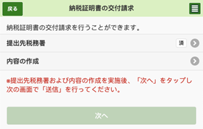

<!-- SPDX-License-Identifier: CC-BY-4.0 -->

# ![PR][PR_Icon] Guide to permanent residency (PR) In Japan ![PR][PR_Icon]

[PR_Icon]: imgs/pr.png

## Purpose

I successfully applied to PR by myself, without the help from a lawyer. Figuring
out what you need to collect and how to collect it was a bit challenging. I
compiled here several years of findings from myself and my colleagues so that
other people can have a smoother experience. Many colleagues have already used
this guide successfully to convert their status from Engineer/Specialist in
Humanities visa to PR.

This document is written toward foreign immigrant working in Japan who wish to
apply to PR through the point-based system for highly skilled professionals.
People who wish to apply to PR through different means (spouse of a Japanese
citizen…) may still find the information below useful.

## Disclaimer

This document compiles the experience of several individuals with the intent to
help others to more easily gather the required documents to apply to permanent
residency in Japan. This is not legal advice and I provide no guarantees that
following the steps described here will allow you to obtain permanent
residency.

By using this guide, you agree that none of the authors shall be liable for any
damage or loss you may encountered.

## Getting a lawyer

The easiest way to apply is to get support from a specialized agent. But of
course, this will come at a fee: 130,000 JPY on average[^lawyer-cost] (baseline
cost, depending on the lawyer). Lawyer cabinets also offer optional services to
have them go and pick-up the needed documents from the ward and tax offices.

Lawyers previously used by fellow colleagues or acquaintances:

* [https://samurai-law.com/en/](https://samurai-law.com/en/)
* [https://attorney-office.com/lp/](https://attorney-office.com/lp/)
* [https://visa-to.com/](https://visa-to.com/)
* [https://english.visajapan.jp/](https://english.visajapan.jp/)
* *You are welcome to suggest other lawyers you may have gotten services from.*

[^lawyer-cost]: **Source:** Statistics from the Japan Federation of Certified
  Administrative Procedures Legal Specialists Associations, page 28 entry 364
  "永住許可申請":
  [https://www.gyosei.or.jp/wp-content/uploads/2021/03/6f46d768df19ba68e72f5fb6c67dd034.pdf](https://www.gyosei.or.jp/wp-content/uploads/2021/03/6f46d768df19ba68e72f5fb6c67dd034.pdf).

## Free consulting

The Tokyo Regional Immigration Services Bureau allows you to book a free
appointment in English or Japanese to review your application and give you
general advice.

Link: [https://www.moj.go.jp/isa/support/fresc/fresc_2.1.html](https://www.moj.go.jp/isa/support/fresc/fresc_2.1.html)

## PR through the point-based system

There are some exemptions for the general guideline "living in Japan 10 years or
more"
[https://www.moj.go.jp/isa/publications/materials/nyukan_nyukan50.html](https://www.moj.go.jp/isa/publications/materials/nyukan_nyukan50.html).

To get PR using the point-based system for highly skilled professionals you need
to be able to either prove that:

* You had 70 points or more three years before applying for PR and you kept 70
  points or more until applying for PR.

* You had 80 points or more one year before applying for PR and you kept 80
  points or more until applying for PR.

* You met the Specially Highly Skilled Professionals
  ([J-Skip](https://www.moj.go.jp/isa/publications/materials/nyuukokukanri01_00009.html))
  requirements one year before applying for PR and you still met the J-Skip
  requirement when applying for PR.

**N.B.**: You do **not** have to first apply to highly skilled professional
status to get PR.

Be sure to check this list:
[https://www.moj.go.jp/isa/content/001335478.pdf](https://www.moj.go.jp/isa/content/001335478.pdf)
for university points!

## Highly skilled (高度専門職) vs. PR (永住権)

The point system allows one to apply to either the Highly Skilled Professional
(HSP) or to PR status. The HSP has two ranks: HSP (i) and (ii). You can directly
apply to HSP (i) as soon as you have 70+ points. The requirements for applying
to HSP (ii) are similar to PR: you need to be HSP (i) and to maintain 70+ points
for 3 years or 80+ points for one year.

The HSP (i) has a major drawback: it is linked to your employer meaning that if
you change company, you would need to reapply (contrary to the normal status
which only requires you send a notice). The HSP (ii) lifts this requirement.
Overall, I recommend **not** applying to HSP and to just wait to meet the
requirements for PR, i.e. maintaining 70+ points for 3 years or 80+ points for
one year. I applied to HSP and retrospectively, I regret doing so.

That said, HSP has some specific advantages that no other statuses can grant you
such as the possibility to bring your parents to Japan if you have an up to
seven years old child.

For more information see:
[https://en.an-japan.com/2019/11/16/pr-hsp-comparison/](https://en.an-japan.com/2019/11/16/pr-hsp-comparison/).

## Pros and Cons of PR

The PR status will allow you to stay in Japan even if you become
unemployed. This status also allows you to work in domains other than the
designated activities of your current status. This includes, for example, the
possibility of starting your own business.

Besides the right to freely live in Japan with or without work, a most
significant benefit is accommodation loan. With PR, you can expect to get the
same interest rate as Japanese Citizens and also a zero down payment. One thing
worth mentioning here is that some banks will still grant you those benefits
even if you are just in the process of PR application.

A drawback is that it may affect your tax status, e.g. you may risk becoming
subjected to the exit tax[^exit-tax]. Regardless of PR, anyone living in Japan
for a period of more than 5 years in the last 10 years becomes a permanent
resident for tax purposes (which is, confusingly, completely separate from
permanent resident for immigration purposes — it's entirely possible to be a
permanent tax resident but not hold a permanent resident resident card, and vice
versa). In any case, if you are concerned about this you should consult a
financial advisor.

[^exit-tax]: c.f. [Exit tax, HSP, PR, and spending five years in
  Japan](https://www.reddit.com/r/JapanFinance/comments/xa9fez/exit_tax_hsp_pr_and_spending_five_years_in_japan/)

## Reporting obligations

The [Permanent Resident Permit
Guidelines](https://www.moj.go.jp/isa/publications/materials/nyukan_nyukan50.html?hl=en)
article 1-(3)-(b) requires you to:

> Appropriately fulfilling public obligations (such as tax payment, payment of
> public pension and public medical insurance premiums, and **reporting
> obligations stipulated in the Immigration Control and Refugee Recognition
> Act**).

Please refer to the "Notifications to the different receptions" section of
[Notification under Article 19-16 and Article 19-17 of the Immigration Control
and Refugee Recognition
Act](https://www.ens-immi.moj.go.jp/NA01/NAA01S/NAA01STransfer) for the detailed
list. One point often omitted is that holders of working visas are required to
notify any change of employers, including company name or address changes, to
the immigration office within 14 days.

Failure to follow any of these reporting obligations may result in your
application being rejected, so double check whether you are up to date before
anything else. In case of irregularities, report your new status as soon as
possible.

## Preparation

Most of the documents that you need to submit must be less than three months old
at the time of application. However, there are a few things that you can (and
should) get in advance:

* Make sure to keep a perfect record over the last two years of the
  contributions to the [national pension system](#年金記録-national-pension-records)
  for you and your dependents. Delays in your pension payments are a common
  cause of rejection.

  If you plan to apply through the spouse visa also confirm your spouse's
  pension payment history.

* My number card (the one with the IC chip). Not directly required but this will
  help you to get some of the required documents more easily: you can get some
  documents from a conbini instead of your ward office and use it to log in the
  pension web service.

* Do the point calculation for the point-based system for highly skilled
  professionals:
  [www.moj.go.jp/isa/publications/materials/newimmiact_3_evaluate_index.html](https://www.moj.go.jp/isa/publications/materials/newimmiact_3_evaluate_index.html?hl=en).

* Start to collect the documents to prove how many points you own now and in the
  past (one or three years ago depending if you have 80+ or 70+ points). The
  work certificates of your past employers can be especially challenging to get,
  so you'd better do it early.

* Make sure that you have a copy of your past payslips or work contracts to
  prove what your income was one or three years ago.

## Translations

Officially, everything should be translated in Japanese, but as a matter of
fact, the immigration will accept most of the documents issued by foreign
authorities as long as they are written in English (e.g. diplomas, work
certificate for foreign employers). For documents written in languages other
than Japanese or English, you will need at least to translate those in
English. You do not necessarily need an official translation: I translated my
diploma from my native language to English myself and got it accepted.

Documents such as your [letter of reason](#理由書-letter-of-reason) (理由書)
must be in Japanese.

## Official checklist

Strictly speaking, there are just three legal requirements as listed here:

[https://www.moj.go.jp/isa/publications/materials/nyukan_nyukan50.html](https://www.moj.go.jp/isa/publications/materials/nyukan_nyukan50.html)

Especially, paid attention to the fact that: "*The applicant must be residing in
Japan with the longest period of stay possible for their current status of
residence*", meaning that people with a period of stay of one year can not
apply.

Practically speaking, those legal requirements unfold into a longer official
checklist:

* Japanese: [https://www.moj.go.jp/isa/applications/procedures/16-4.html](https://www.moj.go.jp/isa/applications/procedures/16-4.html)

* English: [https://www.moj.go.jp/isa/applications/procedures/16-4.html?hl=en](https://www.moj.go.jp/isa/applications/procedures/16-4.html?hl=en)

The details to apply through the point-based system are listed here:

* Japanese: [https://www.moj.go.jp/isa/applications/procedures/nyuukokukanri07_00131.html](https://www.moj.go.jp/isa/applications/procedures/nyuukokukanri07_00131.html)

* English: [https://www.moj.go.jp/isa/applications/procedures/nyuukokukanri07_00131.html?hl=en](https://www.moj.go.jp/isa/applications/procedures/nyuukokukanri07_00131.html?hl=en)

**Please refer to this procedure first. The sections below provide extra help on
the potential pain points but will not detail all steps.** In particular, we
will not paraphrase the contents of the checklist and we will not cover trivial
things such as how to use a photomaton to take your ID photo.

**Caution:** Immigration is now providing a [multi language page with automatic
translation](https://www.moj.go.jp/isa/other_languages.html?hl=en). Make sure to
check the Japanese version at least once for your final check (or request [Free
consulting](#free-consulting)). For example, the certificate of residence
(Juminghyo – 住民票) is translated as *"Resident card of all family members
(household) including the applicant"*, which could be misinterpreted as the
residence card (Zairyu card – 在留カード).

## 住民票: Certificate of residence

If you have the *my number card* with the IC chip, you should be able to get it
at the combini by following [this
guide](https://practicaljapan.com/how-to-print-out-official-certificates-at-convenience-stores/).

Alternatively you can directly go to the ward office.

## 課税証明書 and 納税証明書: Resident tax certificates (from ward office)

You need to obtain two income/tax certificates from the ward office (区役所):

1. The tax declaration certificate (課税証明書).

1. The certificate of tax payment (納税証明書).

You need to only prove the last year if you have 80+ points and the last three
years if you have 70+ points.

### From the combini

If you have the *my number* card with the IC chip, and depending on which
prefecture or ward you are living in, you may be able to get these at the
combini. Refer to [this site](https://www.lg-waps.go.jp/01-04.html) (Japanese)
to check if this service is available for your location.

### From the ward office

Alternatively, you can of course directly go to the ward office (区役所). When
going to the ward office, check first if there is a local branch closer to your
place. Local branches are usually named 市役所 or 出張所. The local branches,
even if smaller, have way less visitors and are, by experience, overall quicker.

### By postal mail to the ward office

If you do not want to move from home, you can also do it by postal mail (lead
time was four business days for me).

To apply by postal mail, you need to prepare:

* A copy of an ID document (resident card, driving license, passport…)

* 300 JPY worth of postal money order (定額小為替証書) for each requested
  document: you can buy it at the post office. For example, if you have 70+
  points, you will need in total 6 certificates (the last three years of 1. and
  2.) so, in that case, you need to attach $6 \times 300 = 1800 JPY$ worth of
  postal money order.

* [This form filled](forms/application_for_resident_tax_certificates.pdf)[^tax-certificate-form].

* A return envelope, pre-stamped, with your address (stamp should be 140 JPY if
  the envelope is A4 format, 110 JPY for the smaller three-fold format).

Finally, send everything to the relevant ward office.

[^tax-certificate-form]: This form is edited by Chuo-ku ward office but it will
  be accepted by the other ward offices as well.

### Which ward office?

The certificates should be requested not to your current ward office but to the
ward office in which you were living as of January 1st of the requested
year. So, if you need to prove 3 years of income/tax (i.e. 70+ points), you have
to pay a separate visit or send separate postal mail to each of the previous
ward offices you lived at.

For additional details, please check this page (in Japanese):
[https://www.city.chuo.lg.jp/smph/kurasi/zeikin/zeinosyoumei/yusousinsei.html](https://www.city.chuo.lg.jp/smph/kurasi/zeikin/zeinosyoumei/yusousinsei.html)

## 納税証明書その３: Income tax certificates (from tax office)

You need another tax payment certificate stating that, as of now, your payment
of income taxes is up to date: the 納税証明書その３.

Contrary to the other certificates, you must obtain this one from the tax office
(税務署).

### Which tax office?

You will request this from your local branch of the National Tax
Office from where you were living January 1st of this year. This is
NOT from the Metropolitan Tax Office. Depending on where you live, the
name of the tax office might not match the name of your ward. To look
up which tax office branch has jurisdiction over where you were
living, check the following website on the right side:
[https://www.nta.go.jp/index.htm](https://www.nta.go.jp/index.htm)

### By postal mail to the tax office

One more time, you can do it by postal mail (the lead time was four business
days for me).

To apply by postal mail, you need to prepare:

* A copy of your my number card

* A copy of an ID document (resident card, driving license, passport…)

* 400 yen worth of national revenue stamps (収入印紙): you can buy it at the
  combini or the post office.

* [This form filled](forms/application_for_income_tax_certificates.pdf)
  (most of it is prefilled for you, just add your name, address and *my number*
  at the top).

* A pre-stamped return envelope with your address (stamp should be 140 JPY if
  the envelope is A4 format, 110 JPY for the smaller three-fold format).

Finally, send everything to the tax office of the place you were living as of
January 1st this year.

For additional details, please check this page (in Japanese):
[https://www.nta.go.jp/taxes/nozei/nozei-shomei/01.htm#shomen](https://www.nta.go.jp/taxes/nozei/nozei-shomei/01.htm#shomen)

### On the eTax website

If you have a my number card and a smartphone with the mynaportal app installed
([Android](https://play.google.com/store/apps/details?id=jp.go.cas.mpa),
[iPhone](https://apps.apple.com/us/app/mynaportal/id1476359069)), you can use
the online system to request the tax certificate via [e-Taxソフト
(SP版
)](https://clientweb.e-tax.nta.go.jp/UF_WEB/WP000/FCSE00001/SESP0010SCRSP.do).
The above instructions are still helpful when requesting the documents. Note
that the online system is accessible from 8:30 to 23:59 every working day.

1. Start by logging in via QR code:

   

   

1. Then you should see a screen where you can request for documents or check
   your inbox.

   

1. Request your paperwork by following the second link (note, that Google
   Translate on Chrome works on this page quite well).

1. Select the bottom link below:

   

1. Make sure to select the tax office branch that has the correct jurisdiction
   mentioned in the above sections

   

1. Go through the wizard, it is not obvious that it is a wizard, but each line
   may need to be expanded and information added and a button pressed to submit
   the additions. For example, going through the selection of the Tax Bureau
   selection looks like this (note the extra text appearing after the
   completion).

   On the wizard, select the following items:

   

   Next page. Enter "永住許可申請" (PR residence application)

   

   

   

   

1. Then on the next day, go to your inbox (the third link)

   

   

1. And then you should have a message asking you to pay (your documents won't be
   sent until you pay). You can pay by internet banking:

   

### Unpaid taxes

The tax certificate from the ward office (納税証明書) has three fields:

1. **納付済額:** already paid amount

1. **未納税額:** amount of unpaid tax

1. **未納税額のうち納期限未到来額:** amount of unpaid tax not yet due

If fields 2. and 3. display zero JPY, congratulations, everything is up to date!

If you have pending taxes, then field 2. represents the sum of due and not yet
due taxes. Field 3. is a subset of field 2. and representing the portion which
is not yet due.

If all your taxes are not yet due (i.e. you are still in time for your payment),
then 2. and 3. would display the same amount. This is a normal situation which
usually occurs after a change in your situation such as an increase of salary or
change of company. The amount automatically deducted from your salary did not
reflect the new situation and thus, these unpaid taxes appeared during the tax
adjustment calculation. In such a case, you may want to ask your HR for
confirmation that these will be paid through automatic salary deduction. After
confirmation, just attach a note to your tax certificate explaining the reason
for these unpaid taxes.

If 2. is strictly greater than 3., then you are not up to date in your tax
payments. At this point, you should have already received some dunning
letters. In all cases, you should contact your ward office to resolve your
pending taxes.

## 年金記録: National pension records

You need to prove that you are registered in the national Japanese pension
system and that your contributions are up to date. You have three alternatives
to get your records:

1. You can do this online on the national pension website: ねんきんネット
   ([https://www.nenkin.go.jp/](https://www.nenkin.go.jp/)). This is the
   recommended method. Details follow.

1. You can directly go to your local pension office (年金事務所). Some people
   experienced a long lead time (up to three months) in the past. Recent
   experiences tend to show that wait time is now removed with the possibility
   to get all documents immediately.

1. You can also call via phone 0570-058-555 and ask the pension office to send
   it to your home address. Please tell that '*全期間分（封書）を交付希望 –
   Zenkikanbun Fusho wo Kofukibou*'. Same as above, it may take extra time to be
   processed.

### Logging in Nenkin Net

The easiest way is to log in with your *my number card*. To do so:

1. You first need a smartphone with an NFC card reader[^ic-card-reader].

1. Then download the My Number portal App
   ([Android](https://play.google.com/store/apps/details?id=jp.go.cas.mpa&hl=en_US&gl=US),
   [iPhone](https://apps.apple.com/us/app/%E3%83%9E%E3%82%A4%E3%83%8A%E3%83%9D%E3%83%BC%E3%82%BF%E3%83%ABap/id1476359069?mt=8)).

1. Go to [https://myna.go.jp/html/index_en.html](https://myna.go.jp/html/index_en.html)

1. Click on , then .

1. Scan the QR code with the My Number App and follow the instructions.

1. Click on: 

1. Finally, link your account to the Nenkin Net website and access it:

   

If you do not have the *my number card*, you can still create your account
directly on the [https://www.nenkin.go.jp/](https://www.nenkin.go.jp/) website,
but you will need to wait approximately one week to receive a postcard to
activate your account.

[^ic-card-reader]: Or alternatively, you can use an IC or NFC card reader on
  your PC. In such a case, you do not need the smartphone application.

### Getting pension records from Nenkin Net

The below guide applies to the desktop version of Nenkin Net. Smartphone
browsers shall not be used: on top of having a different rendering and missing
some buttons, the smartphone version lacks some information in the final report,
making it not suitable for PR applications.

To retrieve your pension records:

1. Login to Nenkin Net (c.f. [supra](#logging-in-nenkin-net)).

1. Scroll down and click on 年金記録を確認する

   

1. Select 月別の年金記録を確認する

   

1. On the right hand side, select 印刷に適した画面を表示します. It will open a
   new window and you can print directly or save as PDF.

   

If you want to get the latest month, please note that your record gets updated
somewhere between the 4th and 6th of the month.

### Category I insured persons (paying 国民年金)

If you or your dependents were enrolled as *Category I insured persons* in Japan
National Pension (国民年金) and had to pay pension premiums by yourselves for
any period within last 1 or 3 years (depending on points), you will also need to
submit proof that you have paid these premiums on time and not late. The easiest
way to prove on-time payment are stamped payment receipts for the premiums and
providing copies of these receipts is enough.

In case you have paid the premiums but do not have the receipts anymore, you
will need to include the 被保険者記録照会回答票 and 被保険者記録照会（納付1・過
不足納）documents that show dates of payment with your application. You can only
get a 被保険者記録照会（納付1・過不足納）through your local Pension Office
either in person or by phone. It is not available through Nenkin Net. A 被保険者
記録照会回答票 can be retrieved through Nenkin Net but is not enough to prove
on-time payment by itself.

## National Health Insurance system

In case if you or your dependents were insured by the Japan National Health
Insurance system (国民健康保険) and were not on an employer-provided insurance
for any period in the last 1 or 3 years (depending on points) and had to pay
health insurance premiums yourselves, you will need to prove on-time payment of
these premiums.

To prove on-time payment of National Health Insurance premiums, you need to
include stamped receipts in your application.

If you don't have the receipts anymore, your Ward Office may be able to help you
recover them or get proof of on-time payment but this is not yet confirmed.

## Certificate of employment and certificate of income

Either or these documents may be used as a proof of income:

* 在職証明書: Certificate of Employment

* 給与見込み証明書: Certificate of Salary Prospect

The human resource department of your company should be able to provide you any
of these.

The difference between the Certificate of Salary and the Certificate of Salary
Prospect is that the former one states your past salary while the latter states
your expected future salary. Either can be used for PR applications. If you
recently had a significant increase in salary, requesting the Certificate of
Salary Prospect might get you more points and better serve your cause.

## 理由書: Letter of reason

This is a statement, in free form, explaining why you are applying. It must be
written in Japanese. This is basically a tribune for you to convince the
immigration officer that you showcased good behavior so far and that you deserve
the PR status. Overall, you should emphasize that:

* you have stable incomes and/or sufficient savings.

* you are bringing value to Japanese society (e.g. through your work or through
  your past personal and professional achievements).

* you are integrated in Japanese society and understand the culture and the
  manners (any volunteer activity is a plus).

* you have intentions to stay in Japan for the long term.

If you have any irregularities, such as driving records, it is wise to state
them here and express your regrets.

## Guarantor

You will need to find a guarantor to apply to PR. The guarantor acts more as a
sponsor than anything else (i.e. they have no legal obligations towards
you). The guarantor can be either a Japanese citizen or a permanent resident. In
the past, the guarantor also had to provide his or her tax and income
certificates but this requirement was lifted off on June 1st 2022.

## Optional: Recommendation Letter

Recommendation letters are not mandatory in a PR application. Whether or not you
meet other criteria, the recommendation letter will not help so there is no real
need to prepare one.

If you still want to prepare one, please consult with your managers, friends, or
anyone who knows you and is willing to sponsor you and ask them to highlight
your individual contribution to the Japanese society.

## Freshness of the documents

As stated above, any documents which describe your current situation
(certificate of employment of your current company, tax certificates…) must be
less than three months old. In addition, the documents should reflect your
current situation. So for example, if you recently moved to a new apartment or
if you recently changed your job, it is wiser to submit certificates issued
after that change.

This rule does not apply to "historical documents" such as your student degrees
or the employment certificates of your past employers.

Also, you are required[^6] to proactively report any changes in your situation
while your application is being processed (can be done by postal mail). Refer to
[Template 1: Notification of change of
address](#template-1-notification-of-change-of-address) if you moved to a new
location.

[^6]: c.f. The [Acknowledgment
  Form](https://www.moj.go.jp/isa/content/001356126.pdf).

## Request for additional information by immigration

Although not common, after submitting your application, and regardless of
whether or not you followed all the rules above, you might receive a request by
postal mail to submit additional documents that are not part of the official
checklist or more recent versions of what you already submitted. The soft
deadline for such requests is roughly ten days. So make sure to frequently check
your postal mail while your application is being processed!

## Optional: Make an appointment

If you want to go to the Tokyo Regional Immigration Services Bureau to submit
your application, they have an [Online Application Reservation
System](https://www.tokyoimmi-yoyaku.moj.go.jp/en). You can book an appointment
in the system and save you lots of time of waiting.

## Checking status or notifying changes by phone

You can call the immigration office to ask for an update on your application
status. You can also tell them that you would like to update your information or
add documents to your application and they will send you a self-addressed
envelope and a list of documents to include in your case.

Before calling Immigration you should prepare to answer their questions they
will ask to verify your identity:

1. Your application number and application date as written on the receipt you
   receive when applying. Application number looks like 東永P-25-12345.

1. Your name as it is written on your application receipt.

1. Your date of birth.

1. Your nationality as specified in your application.

1. The office you have applied at (Shinagawa, Chiba, etc.).

### Checking application status

If you ask them about the status they would give you one of four possible
states:

* **not started yet**: the queue has not progressed to your case yet.

* **in review**: the queue has progressed to your application and you should be
  hearing back within 2-3 months.

* **final review/final approval**: there is a decision on your case that needs
  to be approved by the head of the Immigration Bureau, you should be hearing
  back within 1 month.

* **they have sent you a letter**: this means that you are getting some sort of
  decision in your mailbox within days.

### Tokyo Immigration

You can call the Tokyo Immigration at 0570-034259 (ext. 610). Unfortunately, it
is very difficult to get through to the Immigration on that number. However the
most efficient way to call and get connected so far is:

1. Dial 0570-034259. Once it picks up and starts speaking dial 111610 (this will
   connect you to the Permanent Residency Inspection line).

1. Then the voice will say either *"navidairu ni otsunagi shimasu…"* or
   *"kochira wa navidairu 0570-034259 desu ga…"*. If it is ***"navidairu ni
   otsunagi shimasu…"*** then stay connected and wait for it to finish the
   sentence, if it is ***"kochira wa navidairu 0570-034259 desu ga…"*** then you
   you will be put on hold and have to wait a little bit more.

1. After the *"navidairu ni otsunagi shiimasu…"* line you may either end up
   **connected to a person** or a different voice may start saying *"**kochira
   wa Tokyo** shutsunyuukoku zairyu kanri kyoku desu…"*. If you hear *"kochira
   wa Tokyo…"* then you should hang up and redial.

Occasionally, the voice may also say *"taihen moushiwake arimasen ga…"* at any
stage and disconnect, in this case you should redial again.

## Final stage: acceptance

When your application is approved, you will receive a postcard in the mail
directing you to come to the immigration office **within three weeks** with:

1. Your passport (旅券)

1. Your current resident card (在留カード)

1. A national revenue stamps worth 8000 yen (収入印紙). This can be purchased at
   the first floor of the immigration office or at any post office

1. The receipt you were issued when you submitted your application (申請受付票)

1. The postcard you just received (この通知書)

When you present these documents to the counter, they will have you wait a bit
and give you a number. When your number gets called, they will give you back
your old resident card punched with a hole, your passport, and the new resident
card with the well deserved status of permanent residency. This is the same as
picking up a newly issued resident card for a visa renewal. Your new card will
be valid for 7 years from the date you pick it up.

## After getting PR

After getting your new residence card, you should notify your bank and your
employer about your new status.

If you have the IC chip my number card, you should also go to the ward office
before it expires and have its validity period extended. The expiration date is
written on the front of your card and matches the expiry date of your previous
residence card. By failing to do so, you would have to reapply for a new my
number card (cost: 500 JPY).

## Oversea travels and re-entry permits as a PR

If you depart Japan, you still need to get a re-entry permit before leaving the
country if you intend to come back, otherwise your PR will lapse at that
time. You can either get the "special" re-entry permit which is automatically
delivered to you at the airport on departure (with 1 year validity) or get a
re-entry permit with up to 5 year validity by applying at the immigration
bureau.

## Appendix A: Documents checklist

Refer to the [Document Checklist for PR in Japan](forms/checklist.md) to make
sure that you are not forgetting anything.

## Template 1: Notification of change of address

If you move to a new location while your application is being processed, you
must notify the immigration office of your new address. To do so, use the
[change of address](forms/change_of_address.docx) template, attach your new
[certificate of residence (住民票)](#住民票-certificate-of-residence) as well as
a recto verso copy of your residence card with the updated address and send it
to the immigration office you originally applied to.

## Sample 1: Letter of Explanation for Non-Applicable Materials

The [letter of Explanation for Non-Applicable
Materials](samples/letter_of_explanation_for_non_applicable_materials.docx)
contains an anonymized copy of an actual letter explaining why some tax and
pension payment certificates of the applicant's spouse could not be provided.

You can refer to that document as a model for similar cases.

## Footnotes
